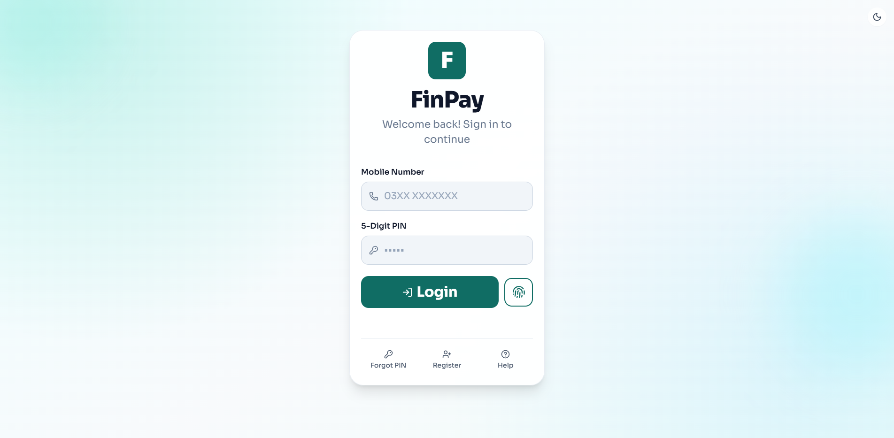

Full Name: Muhammad Alber  
Student ID / Roll Number: su92-bscsm-f23-353  
Instructor: Syed Ahsan Shah

***

# Assignment 1

**Topic:** Introduction to Digital Banking

**Q1: What was the first digital banking channel, and in what year did a small number of banks start developing mobile banking apps?**

<!--  -->

The first recognized digital banking channel was launched in 1980 by Bank One in Columbus, Ohio, under the name "Channel 2000." This system allowed customers to view their bank balances and pay bills using a television set and a telephone line. A few years later, in 1983, Chemical Bank introduced "Pronto," which is widely considered the first true online banking system for home computers.

Mobile banking apps for smartphones began their development in 2007, following the launch of the iPhone. The Royal Bank of Scotland (RBS) and USAA were among the first financial institutions to announce and deploy native mobile banking applications. By 2011, fully functional apps that allowed for real-time fund transfers and bill payments became the industry standard.

**Q2: Based on the standard banking business model, how do Retail Banks, Commercial Banks, and Investment Banks function?**

<!--  -->

The standard banking business model is based on financial intermediation, but each type of bank serves a distinct segment:

* **Retail Banks:** These focus on individual consumers and small businesses. They generate revenue primarily through the Net Interest Margin (NIM), which is the difference between the interest paid to depositors and the interest earned from personal loans, mortgages, and credit cards.
* **Commercial Banks:** These serve mid-sized to large corporations and institutional clients. Their functions include providing business loans, equipment financing, and treasury management services. Their revenue comes from a mix of interest on large-scale lending and service fees for managing corporate liquidity.
* **Investment Banks:** These operate in capital markets for high-net-worth individuals, corporations, and governments. They focus on advisory services (Mergers and Acquisitions), underwriting (IPOs and bond issuance), and sales and trading. Their revenue model is primarily fee-based, earning commissions and success fees from large financial transactions.

**Q3: What elements make up the "Secret Sauce" of digital banking (e.g., UX/CX design, Technology, and Data Innovations)?**

<!--  -->

The "Secret Sauce" that differentiates leading digital banks lies in moving from a transactional utility to a proactive financial partner through several key elements:

* **Anticipatory UX/CX:** Shifting from frictionless design to "anticipatory" interfaces that use AI to predict user needs, such as offering a savings plan exactly when a user hits a financial milestone.
* **Agentic Technology:** Utilizing autonomous AI agents that can perform complex reasoning and execute tasks on behalf of the user, rather than just providing static information.
* **Data Fabric Innovations:** Implementing a unified data architecture that provides a real-time, 360-degree view of the customer across all channels, enabling hyper-personalization and silent authentication via behavioral biometrics.
* **Invisible Banking:** Integrating financial services directly into non-financial platforms (Embedded Finance), making banking a seamless part of daily life.

**Q4: How does firewall hardware work, and what are the main drawbacks of digital banking?**

<!--  -->

Hardware firewalls are physical security appliances positioned at the bank's network perimeter. They function through:

* **Packet Inspection:** Using dedicated chips (ASICs) to filter incoming and outgoing traffic at high speeds.
* **Stateful Inspection:** Tracking active connection states to ensure incoming data is part of a legitimate, established session.
* **Deep Packet Inspection (DPI):** Looking inside data payloads to identify malicious patterns or unauthorized data transfers.

The main drawbacks or challenges associated with these systems in a digital banking context include:

* **Latency:** High-security inspections can introduce delays in real-time transaction processing.
* **Scalability Bottlenecks:** Physical hardware has fixed throughput limits and cannot scale elastically like cloud-based security.
* **Internal Blind Spots:** Perimeter firewalls often lack visibility into "East-West" traffic, allowing hackers who breach one internal system to move laterally between servers.
* **Maintenance Overhead:** They require physical space, cooling, and manual updates, which can be less agile than modern software-defined security.
